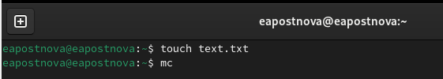
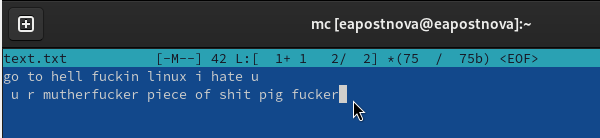
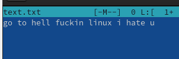
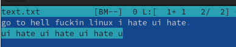
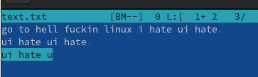
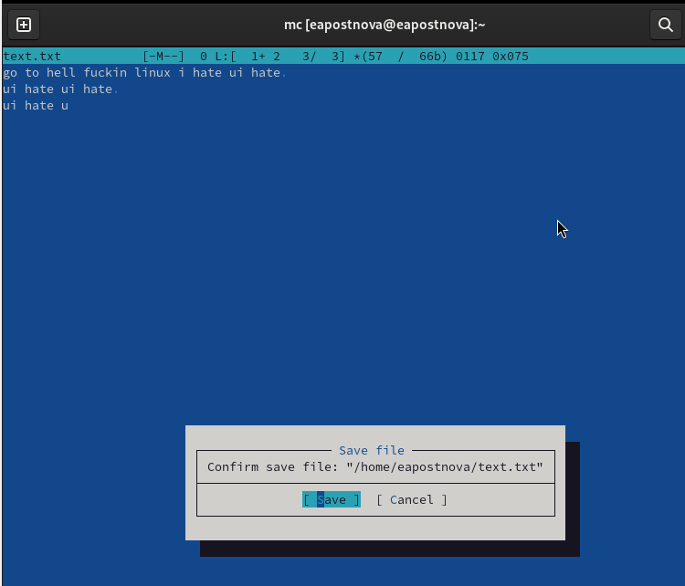
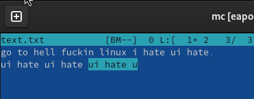
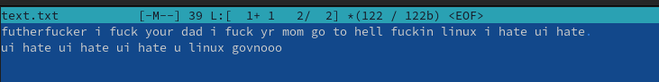
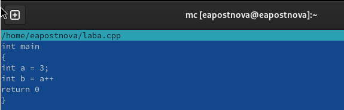

---
## Front matter
lang: ru-RU
title: Лабораторная работа №9
subtitle: Операционные системы
author:
  - Постнова Е. А., НКАбд-05-23
institute:
  - Российский университет дружбы народов, Москва, Россия
date: 04 апреля 2024

## i18n babel
babel-lang: russian
babel-otherlangs: english

## Formatting pdf
toc: false
toc-title: Содержание
slide_level: 2
aspectratio: 169
section-titles: true
theme: metropolis
header-includes:
 - \metroset{progressbar=frametitle,sectionpage=progressbar,numbering=fraction}
 - '\makeatletter'
 - '\beamer@ignorenonframefalse'
 - '\makeatother'
---

# Цель работы

Освоение основных возможностей командной оболочки Midnight Commander. Приоб-
ретение навыков практической работы по просмотру каталогов и файлов; манипуляций
с ними.

# Выполнение лабораторной работы

1. Создайте текстовой файл text.txt.
2. Откройте этот файл с помощью встроенного в mc редактора. (рис. [-@fig:001]).

{#fig:001 width=70%}

3. Вставьте в открытый файл небольшой фрагмент текста, скопированный из любого
другого файла или Интернета (рис. [-@fig:001]).

{#fig:001 width=70%}

4. Проделайте с текстом следующие манипуляции, используя горячие клавиши:
4.1. Удалите строку текста. (рис. [-@fig:001]).

{#fig:001 width=70%}

4.2. Выделите фрагмент текста и скопируйте его на новую строку. (рис. [-@fig:001]).

{#fig:001 width=70%}

4.3. Выделите фрагмент текста и перенесите его на новую строку (рис. [-@fig:001]).

{#fig:001 width=70%}

4.4. Сохраните файл. (рис. [-@fig:001]).

{#fig:001 width=70%}

4.5. Отмените последнее действие. (рис. [-@fig:001]).

{#fig:001 width=70%}

4.6. Перейдите в конец файла (нажав комбинацию клавиш) и напишите некоторый
текст.
4.7. Перейдите в начало файла (нажав комбинацию клавиш) и напишите некоторый
текст (рис. [-@fig:001]).

{#fig:001 width=70%}

4.8. Сохраните и закройте файл. (рис. [-@fig:001]).

{#fig:001 width=70%}

5. Откройте файл с исходным текстом на некотором языке программирования (напри-
мер C или Java) (рис. [-@fig:001]).

{#fig:001 width=70%}

6. Используя меню редактора, включите подсветку синтаксиса, если она не включена,
или выключите, если она включена (рис. [-@fig:001]).

{#fig:001 width=70%}

(рис. [-@fig:001]).

{#fig:001 width=70%}

# Выводы

Я освоила основные возможности командной оболочки Midnight Commander. Приоб-
рела навыки практической работы по просмотру каталогов и файлов; манипуляций
с ними.
