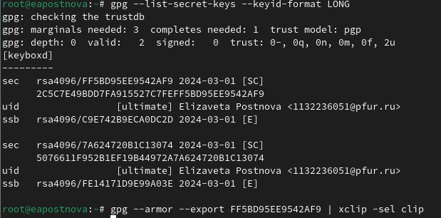

---
## Front matter
lang: ru-RU
title: Лабораторная работа №1
subtitle: Операционные системы
author:
  - Постнова Е. А., НКАбд-05-23
institute:
  - Российский университет дружбы народов, Москва, Россия
date: 02 марта 2024

## i18n babel
babel-lang: russian
babel-otherlangs: english

## Formatting pdf
toc: false
toc-title: Содержание
slide_level: 2
aspectratio: 169
section-titles: true
theme: metropolis
header-includes:
 - \metroset{progressbar=frametitle,sectionpage=progressbar,numbering=fraction}
 - '\makeatletter'
 - '\beamer@ignorenonframefalse'
 - '\makeatother'
---

# Цель работы

Цель данной лабораторной работы -- изучение идеологии и применения средств контроля версий, освоение умения по работе с git.

# Задание

1. Создать базовую конфигурацию для работы с git
2. Создать ключ SSH
3. Создать ключ GPG
4. Настроить подписи Git
5. Заргеистрироваться на GitHub
6. Создать локальный каталог для выполнения заданий по предмету.

##Установка программного обеспечения

Установка git, Установка gh

##Базовая настройка git

Зададим имя и email владельца репозитория, Настроим utf-8 в выводе сообщений git. 

Настройте верификацию и подписание коммитов git с помощью GPG.(рис. [-@fig:001]).

{#fig:001 width=70%}

{#fig:001 width=70%}

{#fig:001 width=70%}

Зададим имя начальной ветки (будем называть её master), Параметр autocrlf, Параметр safecrlf. (рис. [-@fig:001]).

{#fig:001 width=70%}

##Создайте ключи ssh

по алгоритму rsa с ключём размером 4096 бит (рис. [-@fig:001]).

{#fig:001 width=70%}

по алгоритму ed25519 (рис. [-@fig:001]).

{#fig:001 width=70%}

##Создайте ключи pgp 

Генерируем ключ (рис. [-@fig:001]).

{#fig:001 width=70%}

##Добавление PGP ключа в GitHub

Выводим список ключей и копируем отпечаток приватного ключа (рис. [-@fig:001]).

{#fig:001 width=70%}

Cкопируйте ваш сгенерированный PGP ключ в буфер обмена, Используя введёный email, укажите Git применять его при подписи коммитов (рис. [-@fig:001]).

{#fig:001 width=70%}

##Шаблон для рабочего пространства

Сознание репозитория курса на основе шаблона (рис. [-@fig:001]).

{#fig:001 width=70%}

Перейдите в каталог курса, Удалите лишние файлы, Создайте необходимые каталоги (рис. [-@fig:001]).

{#fig:001 width=70%}

Отправьте файлы на сервер (рис. [-@fig:001]).

{#fig:001 width=70%}

# Выводы

При выполнении данной лабораторной работы я изучила идеологию и применение средств контроля версий, освоила умение по работе с git.

# Список литературы{.unnumbered}

1. Dash, P. Getting Started with Oracle VM VirtualBox / P. Dash. – Packt Publishing Ltd, 2013. – 86 сс.
2. Colvin, H. VirtualBox: An Ultimate Guide Book on Virtualization with VirtualBox. VirtualBox / H. Colvin. – CreateSpace Independent Publishing Platform, 2015. – 70 сс.
3. Vugt, S. van. Red Hat RHCSA/RHCE 7 cert guide : Red Hat Enterprise Linux 7 (EX200 and EX300) : Certification Guide. Red Hat RHCSA/RHCE 7 cert guide / S. van Vugt. – Pearson IT Certification, 2016. – 1008 сс.
4. Робачевский, А. Операционная система UNIX / А. Робачевский, С. Немнюгин, О. Стесик. – 2-е изд. – Санкт-Петербург : БХВ-Петербург, 2010. – 656 сс.
5. Немет, Э. Unix и Linux: руководство системного администратора. Unix и Linux / Э. Немет, Г. Снайдер, Т.Р. Хейн, Б. Уэйли. – 4-е изд. – Вильямс, 2014. – 1312 сс.
6. Колисниченко, Д.Н. Самоучитель системного администратора Linux : Системный администратор / Д.Н. Колисниченко. – Санкт-Петербург : БХВ-Петербург, 2011. – 544 сс.
7. Robbins, A. Bash Pocket Reference / A. Robbins. – O’Reilly Media, 2016. – 156 сс.

