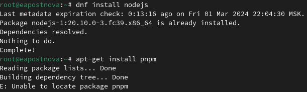
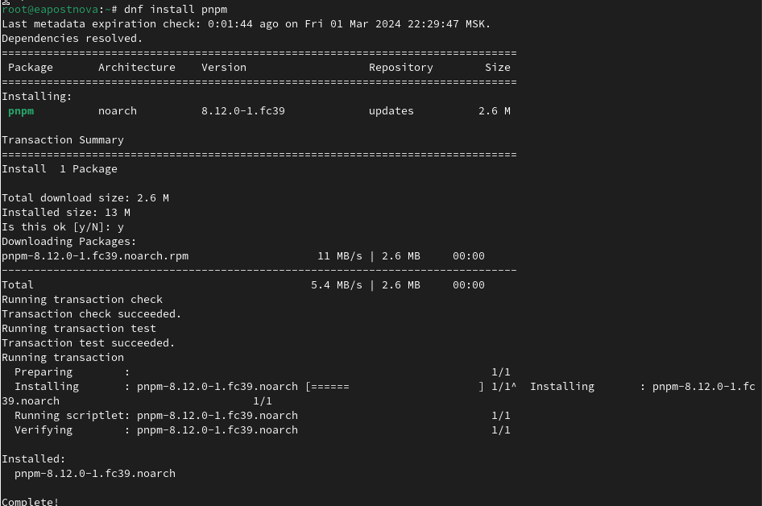
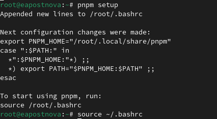
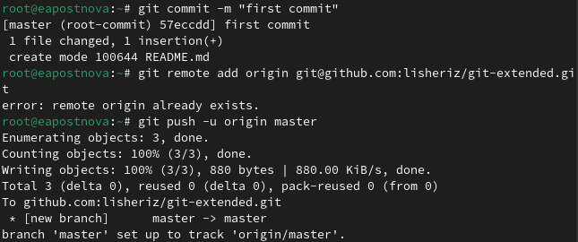
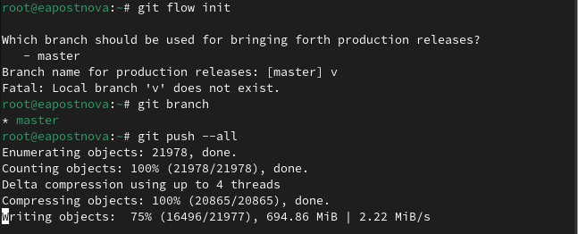
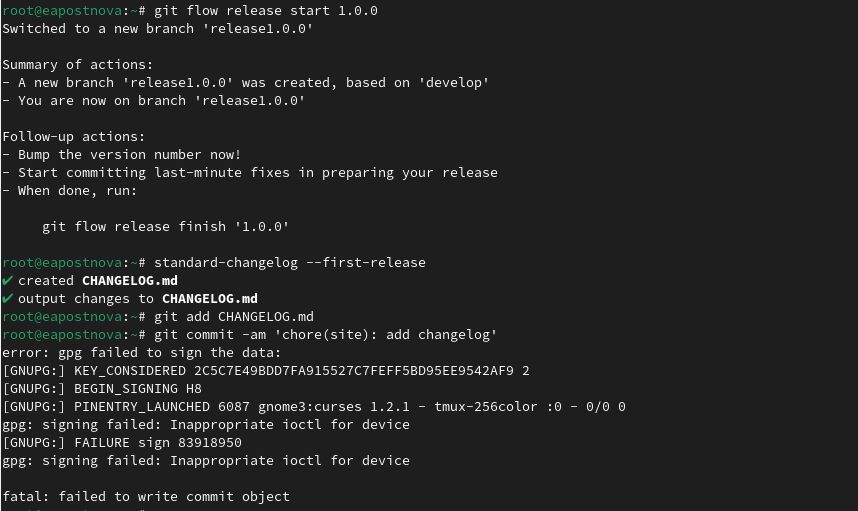
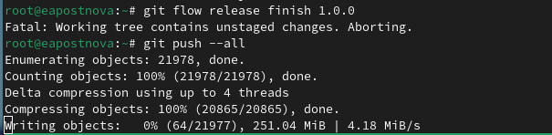
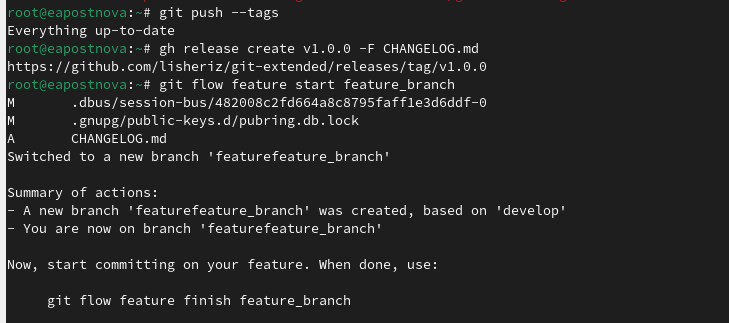
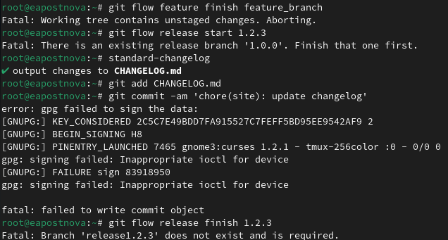

---
## Front matter
lang: ru-RU
title: Лабораторная работа №1
subtitle: Операционные системы
author:
  - Постнова Е. А., НКАбд-05-23
institute:
  - Российский университет дружбы народов, Москва, Россия
date: 02 марта 2024

## i18n babel
babel-lang: russian
babel-otherlangs: english

## Formatting pdf
toc: false
toc-title: Содержание
slide_level: 2
aspectratio: 169
section-titles: true
theme: metropolis
header-includes:
 - \metroset{progressbar=frametitle,sectionpage=progressbar,numbering=fraction}
 - '\makeatletter'
 - '\beamer@ignorenonframefalse'
 - '\makeatother'
---

# Цель работы

Получение навыков правильной работы с репозиториями git

# Задание

1. Выполнить работу для тестового репозитория.
2. Преобразовать рабочий репозиторий в репозиторий с git-flow и conventional commits.

##Установка программного обеспечения

Установка git-flow, Установка Node.js (рис. [-@fig:001]).

{#fig:001 width=70%}

{#fig:001 width=70%}

Настройка Node.js (рис. [-@fig:001]).

{#fig:001 width=70%}

##Общепринятые коммиты

Создание репозитория git (рис. [-@fig:001]).

{#fig:001 width=70%}

Конфигурация git-flow, Загрузите весь репозиторий в хранилище (рис. [-@fig:001]).

{#fig:001 width=70%}

Создадим релиз с версией 1.0.0, Создадим журнал изменений, Добавим журнал изменений в индекс (рис. [-@fig:001]).

{#fig:001 width=70%}

Зальём релизную ветку в основную ветку, Отправим данные на github (рис. [-@fig:001]).

{#fig:001 width=70%}

{#fig:001 width=70%}

Создадим релиз с версией 1.2.3, Создадим журнал изменений, Добавим журнал изменений в индекс, Зальём релизную ветку в основную ветку, Отправим данные на github, Создадим релиз на github с комментарием из журнала изменений (рис. [-@fig:001]).

{#fig:001 width=70%}

# Выводы

Я приобрела практические навыки правильной работы с репозиториями git.

# Список литературы{.unnumbered}

1. Dash, P. Getting Started with Oracle VM VirtualBox / P. Dash. – Packt Publishing Ltd, 2013. – 86 сс.
2. Colvin, H. VirtualBox: An Ultimate Guide Book on Virtualization with VirtualBox. VirtualBox / H. Colvin. – CreateSpace Independent Publishing Platform, 2015. – 70 сс.
3. Vugt, S. van. Red Hat RHCSA/RHCE 7 cert guide : Red Hat Enterprise Linux 7 (EX200 and EX300) : Certification Guide. Red Hat RHCSA/RHCE 7 cert guide / S. van Vugt. – Pearson IT Certification, 2016. – 1008 сс.
4. Робачевский, А. Операционная система UNIX / А. Робачевский, С. Немнюгин, О. Стесик. – 2-е изд. – Санкт-Петербург : БХВ-Петербург, 2010. – 656 сс.
5. Немет, Э. Unix и Linux: руководство системного администратора. Unix и Linux / Э. Немет, Г. Снайдер, Т.Р. Хейн, Б. Уэйли. – 4-е изд. – Вильямс, 2014. – 1312 сс.
6. Колисниченко, Д.Н. Самоучитель системного администратора Linux : Системный администратор / Д.Н. Колисниченко. – Санкт-Петербург : БХВ-Петербург, 2011. – 544 сс.
7. Robbins, A. Bash Pocket Reference / A. Robbins. – O’Reilly Media, 2016. – 156 сс.
