---
## Front matter
lang: ru-RU
title: Лабораторная работа №7
subtitle: Операционные системы
author:
  - Постнова Е. А., НКАбд-05-23
institute:
  - Российский университет дружбы народов, Москва, Россия
date: 02 марта 2024

## i18n babel
babel-lang: russian
babel-otherlangs: english

## Formatting pdf
toc: false
toc-title: Содержание
slide_level: 2
aspectratio: 169
section-titles: true
theme: metropolis
header-includes:
 - \metroset{progressbar=frametitle,sectionpage=progressbar,numbering=fraction}
 - '\makeatletter'
 - '\beamer@ignorenonframefalse'
 - '\makeatother'
---

# Цель работы

Ознакомление с файловой системой Linux, её структурой, именами и содержанием
каталогов. Приобретение практических навыков по применению команд для работы
с файлами и каталогами, по управлению процессами (и работами), по проверке исполь-
зования диска и обслуживанию файловой системы.

# Выполнение лабораторной работы

 1. Выполните все примеры, приведённые в первой части описания лабораторной работы.
 2. Выполните следующие действия, зафиксировав в отчёте по лабораторной работе
используемые при этом команды и результаты их выполнения:

2.1. Скопируйте файл /usr/include/sys/io.h в домашний каталог и назовите его
equipment. 

(рис. [-@fig:001]).

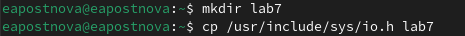{#fig:001 width=70%}

(рис. [-@fig:001]).

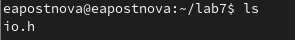{#fig:001 width=70%}

2.2. В домашнем каталоге создайте директорию ~/ski.plases.

(рис. [-@fig:001]).

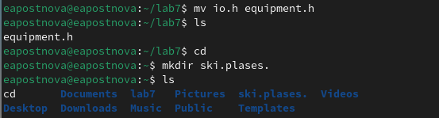{#fig:001 width=70%}

2.3. Переместите файл equipment в каталог ~/ski.plases.

(рис. [-@fig:001]).

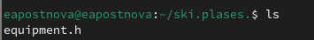{#fig:001 width=70%}

2.4. Переименуйте файл ~/ski.plases/equipment в ~/ski.plases/equiplist.
2.5. Создайте в домашнем каталоге файл abc1 и скопируйте его в каталог
~/ski.plases, назовите его equiplist2.
2.6. Создайте каталог с именем equipment в каталоге ~/ski.plases.

(рис. [-@fig:001]).

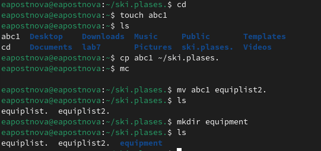{#fig:001 width=70%}

2.7. Переместите файлы ~/ski.plases/equiplist и equiplist2 в каталог
~/ski.plases/equipment.

(рис. [-@fig:001]).

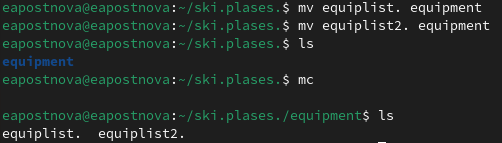{#fig:001 width=70%}

2.8. Создайте и переместите каталог ~/newdir в каталог ~/ski.plases и назовите
его plans.

(рис. [-@fig:001]).

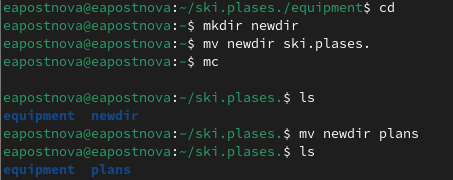{#fig:001 width=70%}

3. Определите опции команды chmod, необходимые для того, чтобы присвоить перечис-
ленным ниже файлам выделенные права доступа, считая, что в начале таких прав
нет:

3.1. drwxr--r-- ... australia

(рис. [-@fig:001]).

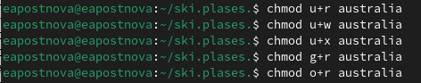{#fig:001 width=70%}

3.2. drwx--x--x ... play

(рис. [-@fig:001]).

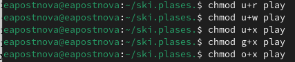{#fig:001 width=70%}

3.3. -r-xr--r-- ... my_os

(рис. [-@fig:001]).

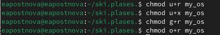{#fig:001 width=70%}

3.4. -rw-rw-r-- ... feathers

(рис. [-@fig:001]).

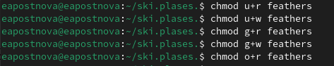{#fig:001 width=70%}

4. Проделайте приведённые ниже упражнения, записывая в отчёт по лабораторной
работе используемые при этом команды:

4.1. Просмотрите содержимое файла /etc/password.

(рис. [-@fig:001]).

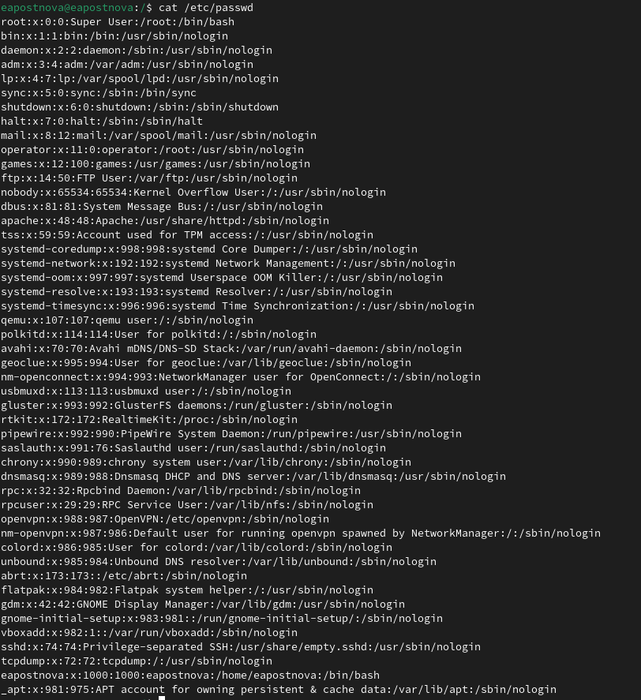{#fig:001 width=70%}

4.2. Скопируйте файл ~/feathers в файл ~/file.old.

(рис. [-@fig:001]).

{#fig:001 width=70%}

4.3. Переместите файл ~/file.old в каталог ~/play.

(рис. [-@fig:001]).

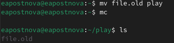{#fig:001 width=70%}

4.4. Скопируйте каталог ~/play в каталог ~/fun.
4.5. Переместите каталог ~/fun в каталог ~/play и назовите его games.

(рис. [-@fig:001]).

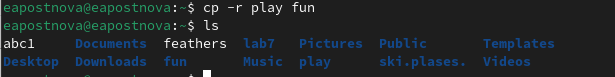{#fig:001 width=70%}

4.6. Лишите владельца файла ~/feathers права на чтение.
4.7. Что произойдёт, если вы попытаетесь просмотреть файл ~/feathers командой
cat?

(рис. [-@fig:001]).

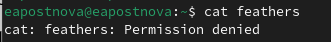{#fig:001 width=70%}

4.8. Что произойдёт, если вы попытаетесь скопировать файл ~/feathers?
4.9. Дайте владельцу файла ~/feathers право на чтение.
4.10. Лишите владельца каталога ~/play права на выполнение.
4.11. Перейдите в каталог ~/play. Что произошло?
4.12. Дайте владельцу каталога ~/play право на выполнение.

(рис. [-@fig:001]).

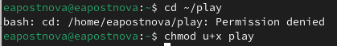{#fig:001 width=70%}

5. Прочитайте man по командам mount, fsck, mkfs, kill

(рис. [-@fig:001]).

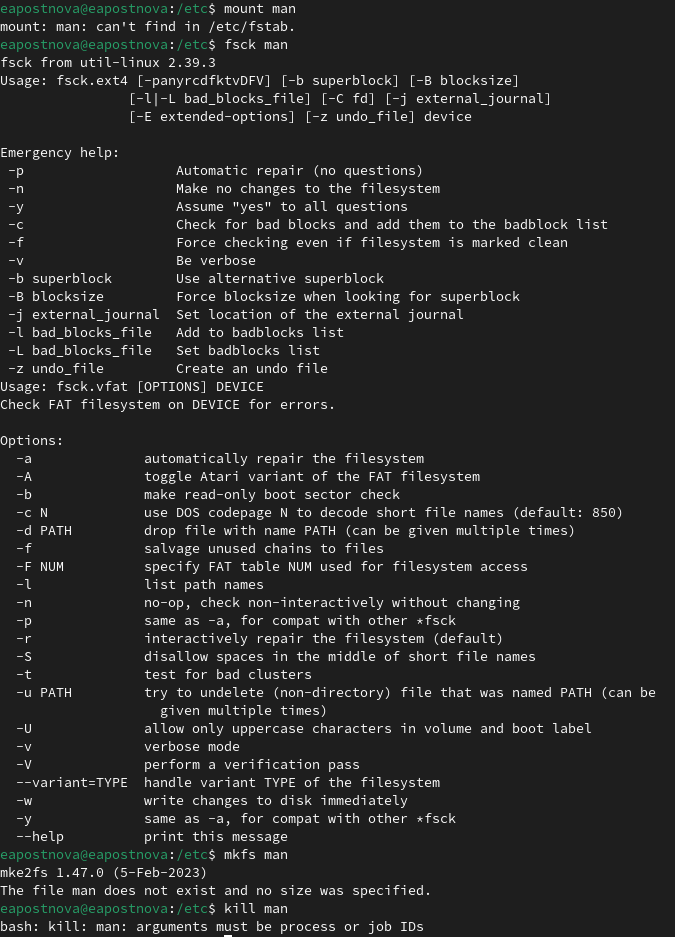{#fig:001 width=70%}

# Выводы

Я ознакомилась с файловой системой Linux, её структурой, именами и содержанием
каталогов. Приобрела практические навыки по применению команд для работы
с файлами и каталогами, по управлению процессами (и работами), по проверке исполь-
зования диска и обслуживанию файловой системы.
