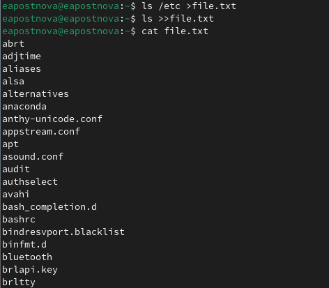
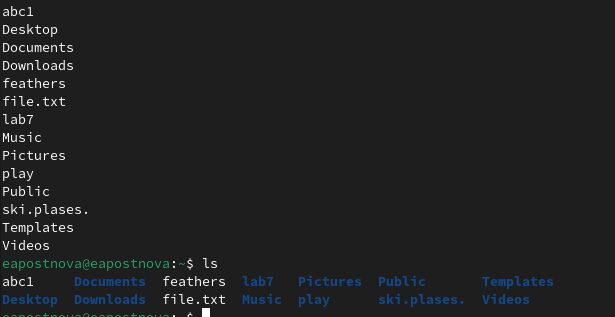
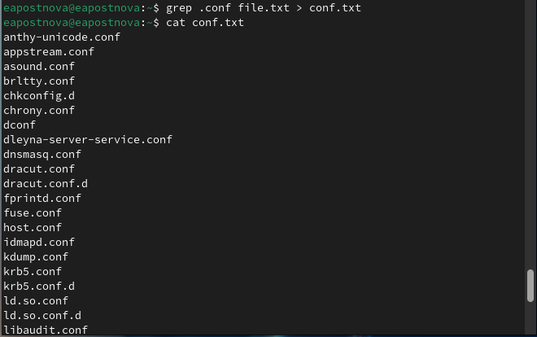
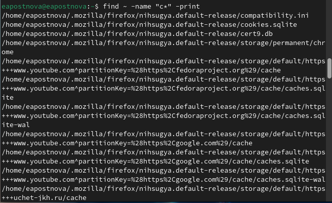
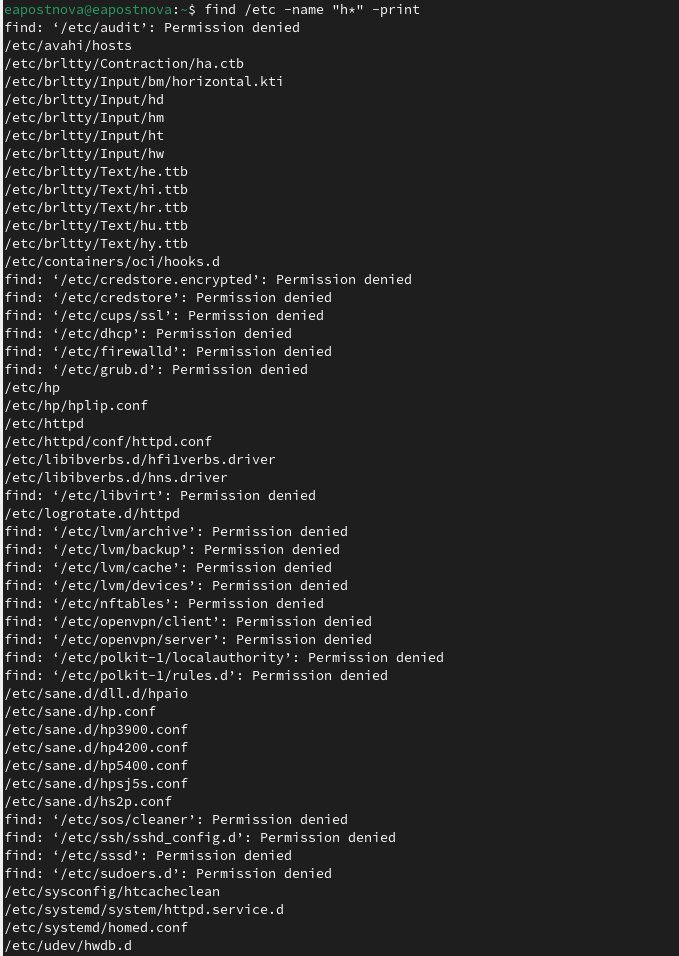
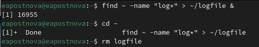
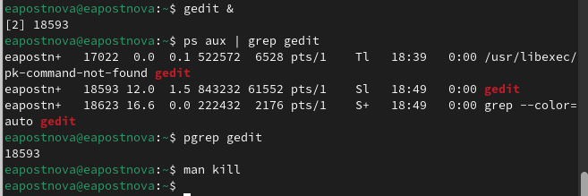
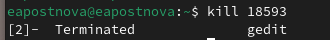
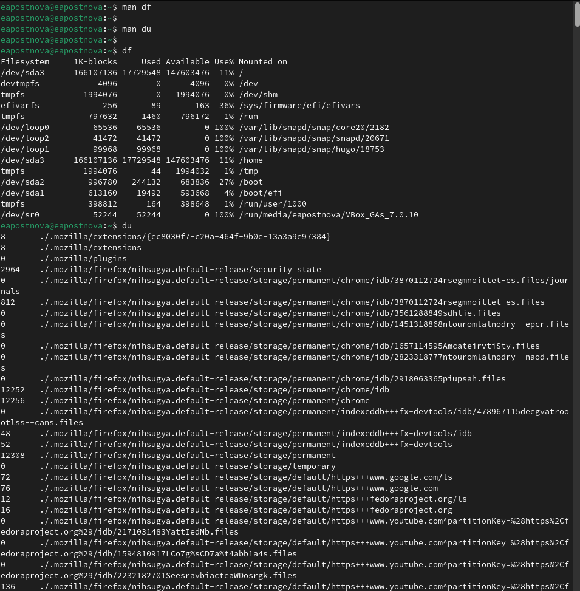
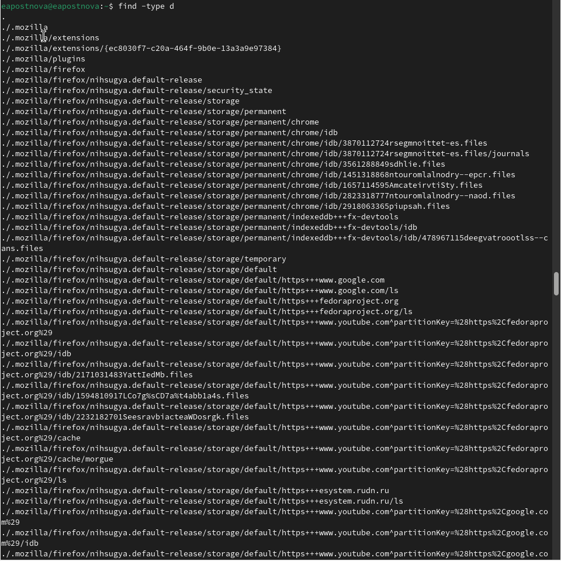

---
## Front matter
lang: ru-RU
title: Лабораторная работа №8
subtitle: Операционные системы
author:
  - Постнова Е. А., НКАбд-05-23
institute:
  - Российский университет дружбы народов, Москва, Россия
date: 02 марта 2024

## i18n babel
babel-lang: russian
babel-otherlangs: english

## Formatting pdf
toc: false
toc-title: Содержание
slide_level: 2
aspectratio: 169
section-titles: true
theme: metropolis
header-includes:
 - \metroset{progressbar=frametitle,sectionpage=progressbar,numbering=fraction}
 - '\makeatletter'
 - '\beamer@ignorenonframefalse'
 - '\makeatother'
---

# Цель работы

Ознакомление с инструментами поиска файлов и фильтрации текстовых данных.
Приобретение практических навыков: по управлению процессами (и заданиями), по
проверке использования диска и обслуживанию файловых систем.

# Выполнение лабораторной работы

1. Осуществите вход в систему, используя соответствующее имя пользователя.
2. Запишите в файл file.txt названия файлов, содержащихся в каталоге /etc. Допи-
шите в этот же файл названия файлов, содержащихся в вашем домашнем каталоге. (рис. [-@fig:001]).

{#fig:001 width=70%}

(рис. [-@fig:001]).

{#fig:001 width=70%}

3. Выведите имена всех файлов из file.txt, имеющих расширение .conf, после чего
запишите их в новый текстовой файл conf.txt (рис. [-@fig:001]).

{#fig:001 width=70%}

4. Определите, какие файлы в вашем домашнем каталоге имеют имена, начинавшиеся
с символа c (рис. [-@fig:001]).

{#fig:001 width=70%}

5. Выведите на экран (по странично) имена файлов из каталога /etc, начинающиеся
с символа h. (рис. [-@fig:001]).

{#fig:001 width=70%}

6. Запустите в фоновом режиме процесс, который будет записывать в файл ~/logfile
файлы, имена которых начинаются с log.
7. Удалите файл ~/logfile. (рис. [-@fig:001]).

{#fig:001 width=70%}

8. Запустите из консоли в фоновом режиме редактор gedit.
9. Определите идентификатор процесса gedit, используя команду ps, конвейер и фильтр
grep. Как ещё можно определить идентификатор процесса?
10. Прочтите справку (man) команды kill, после чего используйте её для завершения
процесса gedit. (рис. [-@fig:001]).

{#fig:001 width=70%}

(рис. [-@fig:001]).

{#fig:001 width=70%}

11. Выполните команды df и du, предварительно получив более подробную информацию
об этих командах, с помощью команды man. (рис. [-@fig:001]).

{#fig:001 width=70%}

12. Воспользовавшись справкой команды find, выведите имена всех директорий, имею-
щихся в вашем домашнем каталоге. (рис. [-@fig:001]).

{#fig:001 width=70%}

# Выводы

Я ознакомилась с инструментами поиска файлов и фильтрации текстовых данных.
Приобрела практические навыки: по управлению процессами (и заданиями), по
проверке использования диска и обслуживанию файловых систем.
