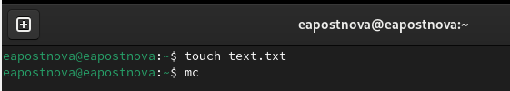
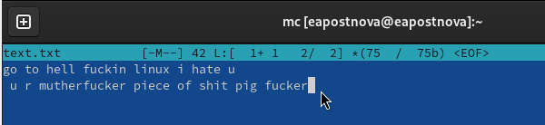
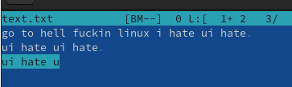
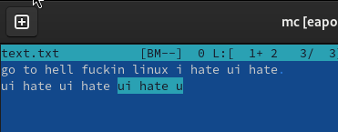
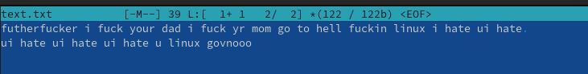

---
## Front matter
title: "Отчет по лабораторной работе №9"
subtitle: "Операционные системы"
author: "Постнова Елизавета Андреевна"

## Generic otions
lang: ru-RU
toc-title: "Содержание"

## Bibliography
bibliography: bib/cite.bib
csl: pandoc/csl/gost-r-7-0-5-2008-numeric.csl

## Pdf output format
toc: true # Table of contents
toc-depth: 2
lof: true # List of figures
lot: true # List of tables
fontsize: 12pt
linestretch: 1.5
papersize: a4
documentclass: scrreprt
## I18n polyglossia
polyglossia-lang:
  name: russian
  options:
	- spelling=modern
	- babelshorthands=true
polyglossia-otherlangs:
  name: english
## I18n babel
babel-lang: russian
babel-otherlangs: english
## Fonts
mainfont: PT Serif
romanfont: PT Serif
sansfont: PT Sans
monofont: PT Mono
mainfontoptions: Ligatures=TeX
romanfontoptions: Ligatures=TeX
sansfontoptions: Ligatures=TeX,Scale=MatchLowercase
monofontoptions: Scale=MatchLowercase,Scale=0.9
## Biblatex
biblatex: true
biblio-style: "gost-numeric"
biblatexoptions:
  - parentracker=true
  - backend=biber
  - hyperref=auto
  - language=auto
  - autolang=other*
  - citestyle=gost-numeric
## Pandoc-crossref LaTeX customization
figureTitle: "Рис."
tableTitle: "Таблица"
listingTitle: "Листинг"
lofTitle: "Список иллюстраций"
lotTitle: "Список таблиц"
lolTitle: "Листинги"
## Misc options
indent: true
header-includes:
  - \usepackage{indentfirst}
  - \usepackage{float} # keep figures where there are in the text
  - \floatplacement{figure}{H} # keep figures where there are in the text
---

# Цель работы

Освоение основных возможностей командной оболочки Midnight Commander. Приоб-
ретение навыков практической работы по просмотру каталогов и файлов; манипуляций
с ними.

# Выполнение лабораторной работы

1. Создайте текстовой файл text.txt.
2. Откройте этот файл с помощью встроенного в mc редактора. (рис. [-@fig:001]).

{#fig:001 width=70%}

3. Вставьте в открытый файл небольшой фрагмент текста, скопированный из любого
другого файла или Интернета (рис. [-@fig:001]).

{#fig:001 width=70%}

4. Проделайте с текстом следующие манипуляции, используя горячие клавиши:
4.1. Удалите строку текста. (рис. [-@fig:001]).

{#fig:001 width=70%}

4.2. Выделите фрагмент текста и скопируйте его на новую строку. (рис. [-@fig:001]).

{#fig:001 width=70%}

4.3. Выделите фрагмент текста и перенесите его на новую строку (рис. [-@fig:001]).

{#fig:001 width=70%}

4.4. Сохраните файл. (рис. [-@fig:001]).

{#fig:001 width=70%}

4.5. Отмените последнее действие. (рис. [-@fig:001]).

{#fig:001 width=70%}

4.6. Перейдите в конец файла (нажав комбинацию клавиш) и напишите некоторый
текст.
4.7. Перейдите в начало файла (нажав комбинацию клавиш) и напишите некоторый
текст (рис. [-@fig:001]).

{#fig:001 width=70%}

4.8. Сохраните и закройте файл. (рис. [-@fig:001]).

{#fig:001 width=70%}

5. Откройте файл с исходным текстом на некотором языке программирования (напри-
мер C или Java) (рис. [-@fig:001]).

{#fig:001 width=70%}

6. Используя меню редактора, включите подсветку синтаксиса, если она не включена,
или выключите, если она включена (рис. [-@fig:001]).

{#fig:001 width=70%}

(рис. [-@fig:001]).

{#fig:001 width=70%}

# Выводы

Я освоила основные возможности командной оболочки Midnight Commander. Приоб-
рела навыки практической работы по просмотру каталогов и файлов; манипуляций
с ними.
